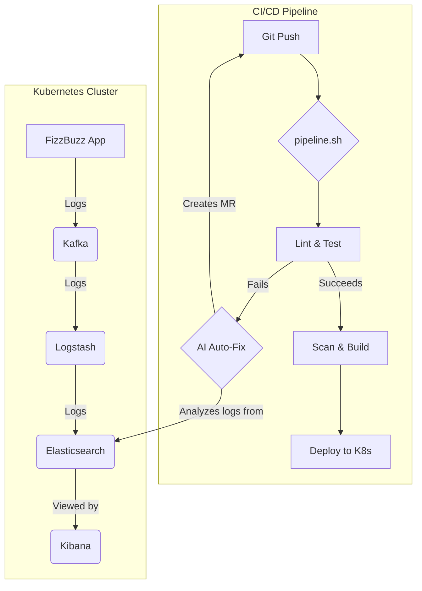

# 🚀 Local AI-Driven DevSecOps Pipeline

Welcome to the **Local AI-Driven DevSecOps Pipeline**! This project provides a fully automated, local CI/CD workflow that integrates security scanning, container orchestration, and an innovative **AI Auto-Fixer** that repairs your code and opens GitLab Pull Requests automatically when tests fail. It also includes a full-fledged microservice ecosystem with a message queue and a logging stack.

It contains only a classic new-commer exercise: The FizzBuzz. This task is to write numbers from 1-100. If the number is divisible by 3, write "Fizz". If the number is divisible by 5, write "Buzz". If the number is divisible by both 3 and 5, write "FizzBuzz".

The good solution is:
```
for i in range(1, 101):
    print("Fizz" * (not i % 3) + "Buzz" * (not i % 5) or i)
```

**Ok. I know it is funny, but it is just an example.**

> I'm testing the configuration to find the best for every situation, so it is possible some issues from time to time. Relax. I'm gonna fix that. However, if you have any suggestion or idea, feel free to leave a comment.

---



---


## ✨ Features

- **Automated DevSecOps Workflow**: 8-stage pipeline covering everything from linting to Kubernetes deployment.
- **Local Kubernetes (Kind)**: Deploys applications to a lightweight, local Kubernetes cluster.
- **GitLab Integration**: Runs a self-hosted GitLab CE instance in an isolated Kubernetes cluster.
- **AI Auto-Fixer (Ollama)**: When Linting or Unit tests fail, a local LLM (`qwen2.5-coder:1.5b`) automatically analyzes the error, writes a fix, and opens a Merge Request in your GitLab project.
- **Complete Microservice Ecosystem**:
    -   **Message Queue (Kafka)**: For asynchronous communication and log transport.
    -   **Logging Stack (Elasticsearch & Kibana)**: For centralized log storage and visualization.
    -   **Log Processing (Logstash)**: To forward logs from Kafka to Elasticsearch.
- **Security First**: Integrated dependency checking (Snyk), secret scanning (Gitleaks), and image vulnerability scanning (Trivy).

---

## 🏗️ Architecture & Pipeline Stages

The pipeline (`pipeline.sh`) executes the following 8 stages in order:

1. 🧹 **Linting (`ruff`)**: Checks code style and syntax. *(AI Enabled)*
2. 🧪 **Unit Testing (`pytest`)**: Runs application tests. *(AI Enabled)*
3. ✅  **Sonar Scan**: Checks code quality.
4. 📦 **Dependency Scan (`snyk`)**: Scans `requirements.txt` for known vulnerabilities.
5. 🔐 **Secret Scan (`gitleaks`)**: Ensures no hardcoded secrets exist in the codebase.
6. 🐳 **Docker Build**: Builds a multi-stage Docker image of the application.
7. 🛡️ **Image Scan (`trivy`)**: Scans the compiled Docker image for OS and library vulnerabilities.
8. 🚀 **Kubernetes Deploy**: Creates a fresh Kind cluster and deploys the entire ecosystem: FizzBuzz App, Ollama, Kafka, Zookeeper, Elasticsearch, Kibana, and Logstash.

---

## 🤖 The AI Auto-Fixer Workflow

If either Step 1 (Linting) or Step 2 (Testing) fails:
1. The pipeline halts and captures the error output.
2. It sends the failing code and error trace to the **Ollama** instance running inside the Kubernetes cluster.
3. The AI model (`qwen2.5-coder:1.5b`) returns a fully patched file in JSON format.
4. The pipeline automatically:
   - Creates a new Git branch (`ai-fix-...`)
   - Applies the patch
   - Commits the fix
   - Pushes to your local GitLab instance
   - Opens a **Merge Request** via the GitLab API.

---

## 🛠️ Prerequisites

Before running the pipeline, ensure you have the following installed on your host machine:
- **Docker** (running)
- **Git**
- **Python 3.x**

---

## 🚀 Getting Started

### 1. Install Dependencies
Run the installation script to set up `kind`, `kubectl`, `snyk`, `trivy`, and `gitleaks`:
```bash
./install_dependencies.sh
```

### 2. Set Up the Local GitLab Environment
Spin up the isolated Kubernetes cluster for GitLab. This script creates the `gitlab-cluster` and deploys GitLab CE:
```bash
./setup_gitlab.sh
```
> **Note:** GitLab is a heavy application. It may take 5-10 minutes to become fully available at `http://localhost:30080`.

To get the initial root password once it's up, run the command printed at the end of the setup script.

### 3. Configure Your GitLab Repository
1. Log in to your local GitLab (`http://localhost:30080`) as `root`.
2. Create a new blank Project.
3. Go to **Edit Profile -> Access Tokens** and create a Personal Access Token with `api` and `write_repository` scopes.
4. Note your **Project ID** (visible on the project overview).
5. Link this local repository to GitLab:
   ```bash
   git remote add origin http://localhost:30080/root/<your-project-name>.git
   git branch -M main
   git push -u origin main
   ```

### 4. Run the Pipeline!
Export your configuration variables and run the DevSecOps pipeline:

```bash
export GITLAB_TOKEN="<your-personal-access-token>"
export GITLAB_PROJECT_ID="<your-project-id>"

# Optional: Set SonarQube token if running a local SonarQube instance
# export SONAR_TOKEN="<your-sonarqube-token>"

./pipeline.sh
```

---

## 📖 Workflow Documentation

For detailed instructions on how to use this toolset in different environments, please refer to the following documents:

- [Local Workflow](./documentation/local_workflow.md)
- [AWS Workflow](./documentation/aws_workflow.md)
- [GCP Workflow](./documentation/gcp_workflow.md)
- [Azure Workflow](./documentation/azure_workflow.md)

---

## 📁 Repository Structure

```
.
├── documentation/          # Workflow documentation for different environments
│   ├── local_workflow.md
│   ├── aws_workflow.md
│   ├── gcp_workflow.md
│   └── azure_workflow.md
├── pipeline.sh             # Main DevSecOps pipeline script
├── setup_gitlab.sh         # Script to spin up the local GitLab K8s cluster
├── install_dependencies.sh # Helper to install CLI tools
├── app.py                  # Sample Python application with Kafka logging
├── test.py                 # Sample Pytest suite
├── requirements.txt        # Python dependencies
├── Dockerfile              # App containerization instructions
└── k8s/
    ├── deployment.yml      # App deployment manifest
    ├── gitlab.yml          # GitLab CE deployment manifest
    ├── kafka.yml           # Zookeeper and Kafka deployment
    ├── logging.yml         # Elasticsearch and Kibana deployment
    ├── logstash.yml        # Logstash deployment
    └── ollama.yml          # Ollama LLM deployment
```

## 🤝 Contributing

Break something on purpose in `app.py` or `test.py` to see the AI Auto-Fixer in action! Contributions and improvements to the pipeline scripts are highly encouraged.

## Next steps
- Add alternative solutions 